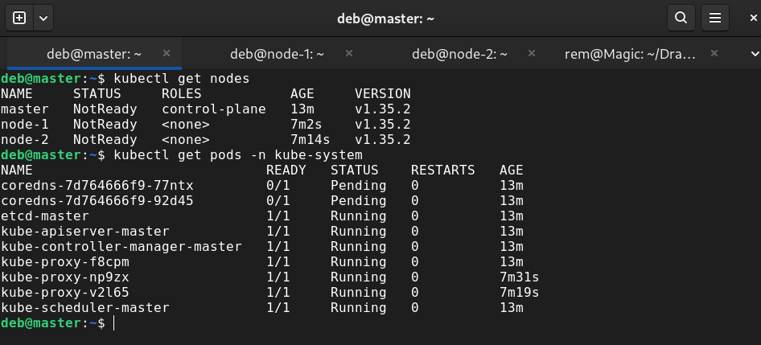

# Kubernetes Cluster with CRI-O

Развертывание Kubernetes кластера с использованием CRI-O в качестве container runtime на трех виртуальных машинах QEMU.

## Архитектура

- **Master**: 192.168.122.101
- **Node-1**: 192.168.122.102  
- **Node-2**: 192.168.122.103

## Компоненты

- Kubernetes v1.35.2
- CRI-O v1.35.0
- Container Runtime: CRI-O
- Network Plugin: Calico (будет установлен)

## Текущий статус

✅ Три виртуальные машины настроены
✅ CRI-O установлен на всех узлах
✅ Kubernetes компоненты установлены (kubeadm, kubelet, kubectl)
✅ Кластер инициализирован (kubeadm init)
✅ Узлы присоединены к кластеру
✅ etcd, kube-apiserver, kube-scheduler работают
❌ CoreDNS в статусе Pending (ожидает установки сетевого плагина)
❌ Узлы в статусе NotReady (ожидают сетевой плагин)

## Документация

- **[Инструкция по установке](docs/installation.md)** — полное руководство по развертыванию кластера с нуля

